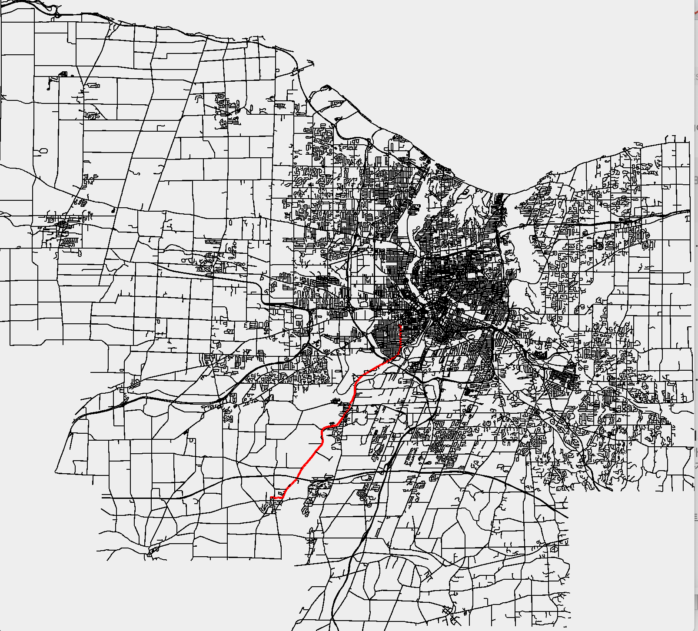

# Street-Mapping
Uses Dijkstra's algorithm to find the shortest path between two intersections. Also uses Java Graphics to display the map and highlight the path.

To run:  
javac StreetMap.java  
java StreetMap mapName.txt --show --directions startIntersection endIntersection

Sample runs:  
java StreetMap ur.txt --show --directions HOYT MOREY // Showing both map and the directions  
java StreetMap ur.txt --show // Just showing the map  
java StreetMap ur.txt --directions HOYT MOREY // Showing the map is optional

The reason we have processInfo() is because  
1) To add edges in the beginning, it is much more efficient to use .add(). But to work with the edges, it is better to have an array edges[].  
2) The only use for the latitudes and longitudes in intersections is to calculate edge length. So after calculating all edge lengths
and storing them in the edge object, we no longer need the Map<String, double[]> Nodemap. Instead, we use a Map<String, Node> where 
the Node stores a list of the edges it connects. This map from label --> Node is better for the Dijkstra Algorithm.   
3) In the nodes, in Map<String, Node>, we have to add information in each node about which edges it is adjacent to. We need this for the
Dijkstra Algorithm.

It is important to store a String prev in each Node. Doing so gives it the shortest total distance to the initial node.   
Because each node only has one prev pointer to another node, there will be only be one path (the shortest path) from the end node
to the initial node.

We do not need to store latitude and longitude in the Node object because the distances for each edge have already been calculated
and stored in the Edge object. Node objects are just points with the following information 1) which edges it is adjacent to, 2) distance from
the source, and 3) the previous node on its shortest path to the source

Notes:
1) To approach the larger maps, I tried modifying my getNext() method so that it will run faster. I had to this because I did not use a PriorityQueue,
which has a built in getMin. My getNext() is basically a getMin, and I feel like this was the reason why it was so slow in the beginning.  
2) The runtime for dijkstra is O(VE) because there are two for-loops, one that goes through keySet and one that goes through the adjacent edges.  
3) The runtime for getNext is O(V) because I go through all nodes and find the minimum.

Screenshot of monroe.txt, Monroe County, NY

